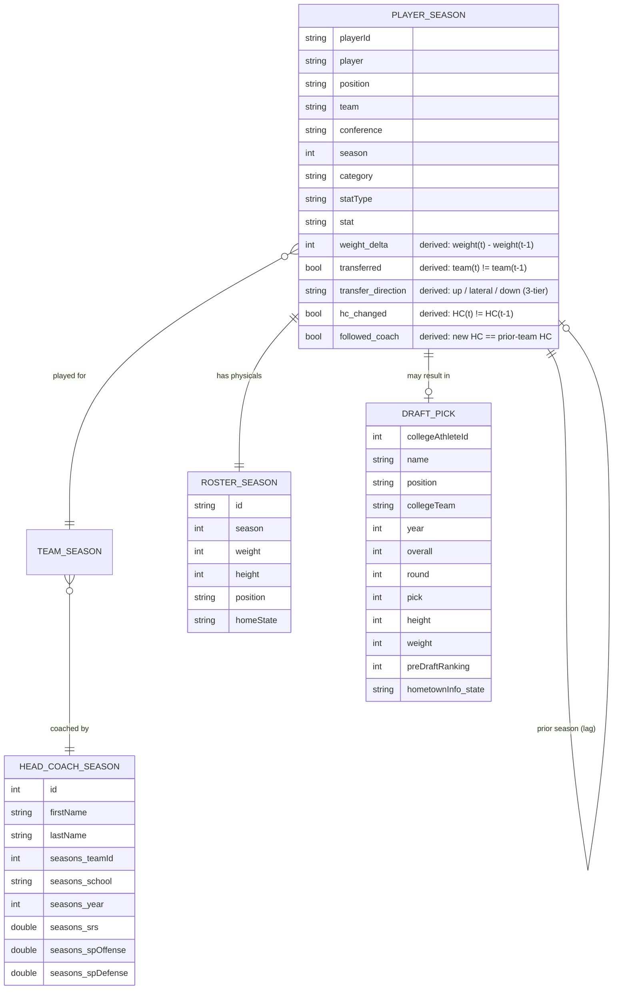

# cfbstats — Project Vision

## 1. Purpose

Explore what actually shapes a college football player's path to the NFL
draft, and how well that path can be **forecast** from information available
during a player's career.

The project is a collaboration driven by a running set of questions:

- What variables of a player's time in football actually matter for becoming
  a pro?
- Does the **head coach** matter? (v1) Later: offensive/defensive
  coordinators, position coaches, strength & conditioning coaches, assistants.
- After each season, what is a player's **percent chance of being drafted**,
  by position?

We want both an **explanatory** answer (which factors carry information, with
uncertainty) and a **predictive** answer (honest out-of-time forecasting of
draft outcomes).

## 2. Guiding philosophy

Framed by Breiman (2001), *Statistical Modeling: The Two Cultures*. We will
deliberately use **both** cultures side by side:

- **Data models** for explanation and inference (e.g., Bayesian hierarchical /
  mixed models with partial pooling by coach, team, position).
- **Algorithmic models** for prediction and information discovery (tree
  ensembles, etc.), interpreted with variable importance and local
  explanations (LIME / Shapley values — TBD).

The workflow is intentionally staged: describe first, make many simple (and
admittedly weak) associations, then build a prediction methodology, engineer
features, fit competing models, and finally evaluate against explicit
hypotheses — judging performance, robustness, and forecasting ability.

## 3. Scope

### v1

- **Coaching**: head coach + program-level signal only (wins, `srs`, SP+
  overall/offense/defense from the CFBD `/coaches` endpoint), plus
  **coaching changes** — did the player's head coach change between seasons,
  and did the player *follow* a coach (see decision 0003).
- **Transfers**: whether a player changed schools between seasons, and the
  **direction** of the move on a season-aware 3-tier scale (Power / Group of 5
  / FCS-and-below; see decision 0003). Derivable today from `player_stats`
  (~16% of players appear at ≥2 teams); optionally enriched via
  `/player/portal`.
- **Physical development**: **weight gain/loss between seasons**, from the
  `/roster` endpoint.
- **Longitudinal layer**: the above are **between-season change** features.
  We link each player's seasons chronologically (by athlete id) and attach
  lagged/delta features to the draft-eligible player-season row — a career
  sequence, not independent snapshots.
- **Outcome**: drafted (from the CFBD `/draft/picks` endpoint).
- **Population (denominator)**: every player with a college stat line, limited
  to their **draft-eligible seasons**.
- **Censoring** (still-enrolled players, transfers, early declares): handled
  pragmatically.

### Later / stretch

- Assistant-coach data (OC/DC, position coaches, S&C) sourced from
  Wikipedia / Wikidata or other web sources — each sourcing effort begins as a
  **feasibility blog post** before it enters the pipeline.
- Alternative "pro" definitions (UDFA signings, any NFL appearance).
- Injuries as a covariate.

## 4. Data

### Sources

CFBD API (`https://api.collegefootballdata.com`), key in `CFBD_API_KEY`:

- `/draft/picks` — historical NFL draft picks.
- `/stats/player/season` — player season stats (currently **long** format:
  one row per category/statType/stat).
- `/coaches` — head coaches with per-season performance.
- `/roster` (by year) — per-season height, **weight**, position, jersey, and
  hometown, keyed by athlete `id`. Source for weight-change features and a
  full player-season backbone (includes players with no qualifying stat line).
- `/player/portal` (optional, recent years) — transfer-portal metadata
  (stars, rating, transfer date) to enrich transfer detection.

Plus future scraped sources for assistant coaches.

### Data model (ERD sketch)

Athlete `id` is the canonical player key (decision 0003): `player_stats.playerId`,
`roster.id`, and (coerced to string) `picks.collegeAthleteId` share one
namespace. A player's seasons are linked chronologically by that id to derive
the longitudinal **change** features (`weight_delta`, `transferred`,
`transfer_direction`, `hc_changed`, `followed_coach`).

### Known data issues to resolve early

- **Player linkage** (resolved — decision 0003): `picks.collegeAthleteId`
  (int), `player_stats.playerId` (string), and `roster.id` (string) are the
  **same athlete-id namespace**. Coerce `collegeAthleteId` to string and join
  directly; ~98–100% of picks from draft year 2013 on carry an id (missing ids
  are pre-2013, outside the 2010–2025 window). Name matching is retired to a
  QA cross-check only.
- **Conference tiers are season-aware**: build a `season × conference → tier`
  lookup (Power / G5 / FCS-and-below) because names and memberships shift over
  2010–2025 (Pac-12 collapse, Big East → AAC, realignment).
- **Long stats**: `player_stats` must be pivoted into position-relevant
  features; discovering which stats carry information is part of the work.
- **Team/coach join keys**: link player-season → head-coach-season via
  team + year.

## 5. Temporal framing & evaluation

- Model **draft-eligible seasons only**.
- **Headline evaluation is out-of-time validation**: a model predicting a given
  draft class may only use data available through the prior season. Train on
  older draft classes, test on newer ones — no leakage.
- Predictions are **per position**: probability of being drafted given
  information available after a season.

## 6. Modeling approaches (candidates)

- Bayesian hierarchical / mixed models with partial pooling (coach, team,
  position) — explanatory.
- Tree ensembles / algorithmic models — predictive, with LIME / Shapley for
  interpretation.
- In-database ML via the `orbital` package where practical.

"Does factor X matter?" is answered **two ways, reported side by side**:
predictive (does adding X improve held-out forecasting / calibration for a
position?) and explanatory (effect size + uncertainty after adjusting for
player production).

## 7. Infrastructure

- **Package workflow**: the repo is developed as an R package using the
  `devtools` workflow (`load_all`, `document`, `test`, `check`). Reusable logic
  (ingestion, cleaning, feature engineering, modeling helpers) lives in `R/`
  with `roxygen2` documentation. That roxygen documentation is surfaced on the
  Quarto website (e.g., via a pkgdown-style reference or `altdoc`) so the code
  docs and the analysis narrative live in one place.
- **Orchestration**: `targets` pipeline covering download → clean → feature
  engineering → modeling → reporting.
- **Storage**: DuckDB file (or partitioned parquet) published as a **GitHub
  release asset**; CI reads it via `piggyback` / `gh release download`. Keeps
  large data out of git history.
- **Site**: Quarto website on **GitHub Pages**, built by **GitHub Actions**,
  which also refreshes CFBD data on a schedule. Includes a blog, dedicated
  description/analysis pages, and interactive visualizations (Observable JS or
  similar).
- **Possible companion app**: a `querychat` app hosted on Posit Connect Cloud.

## 8. Quality: data contracts + TDD

Testing covers **both logic and data**, enforced from the start and run inside
the pipeline so broken assumptions fail fast:

- **Function logic**: `testthat`.
- **Data contracts**: `pointblank` (or equivalent) — expected years, expected
  players/coaches/teams present, no silent row loss across joins, schema
  stability, value ranges. The intent is to never discover *after* modeling
  that variables, players, coaches, or years were missing or misrepresented.

## 9. Decision & learning harness

A durable record of decisions, hypotheses, and outcomes so the repo accumulates
knowledge over time — what was tried, what worked, what didn't, and why. Implemented as an ADR-style
log in [`decisions/`](decisions/) — numbered, dated Markdown entries with an
"Outcome / what we learned" section revisited over time.

## 10. Audience & deliverables

- **Audience**: non-technical football fans *and* coders who love football
  stats and R.
- **Deliverables**: a Quarto website (blog + analysis pages + interactive
  visualizations) on GitHub Pages, continuously updated via GitHub Actions.

## 11. Git workflow

Solo development (one coder; the collaborator contributes questions and domain
ideas, not code). Goal: a **clean, readable `main` history** and a clear line
between throwaway experiments and work we actually integrate. This is an area
to learn as we go — treat the conventions below as a starting point, not fixed
law.

### Branching

- `main` is always deployable; it is the branch GitHub Actions build from.
- Do substantive work on **short-lived feature branches** off `main`
  (`feat/player-linkage`, `data/scrape-coordinators`, `model/hier-baseline`).
- Open a **pull request** when you want CI to run `testthat` tests and
  `pointblank` data contracts before merging. For a solo repo the PR is a
  self-check and CI gate, not a review handoff — direct merges are fine for
  trivial changes, but let CI pass before merging anything data- or
  model-touching.
- **Squash-merge** so `main` gets one clean commit per feature; messy
  work-in-progress commits stay on the branch. Keeps history linear and
  bisectable.

### Experiments vs. integration

- **Experiments / spikes**: throwaway branches (`spike/…`) for "let's just try
  it." Never merged; findings distilled into the decision log (§9).
- **Integrated work**: tested, contract-checked, and documented (roxygen +
  narrative) before it lands on `main`.

### Commit messages

Use [Conventional Commits](https://www.conventionalcommits.org):
`type(scope): summary`. Suggested types: `feat`, `fix`, `data`, `model`,
`docs`, `refactor`, `test`, `ci`, `chore`. Suggested scopes: `pipeline`,
`data`, `model`, `site`. This keeps the log skimmable and can later drive an
automated changelog / release notes.

### CI triggers

- **Push/merge to `main`** → build and deploy the Quarto site to GitHub Pages.
- **Scheduled workflow** → refresh CFBD data and publish updated release
  assets (kept separate from the site build).

## 12. Open questions

- Exact draft-eligibility rule to encode (seasons removed from HS vs. proxy).
- Choice of local-explanation method (LIME vs. Shapley).
- Final form of the decision/learning harness.
- Feasibility and licensing for scraped assistant-coach data.
