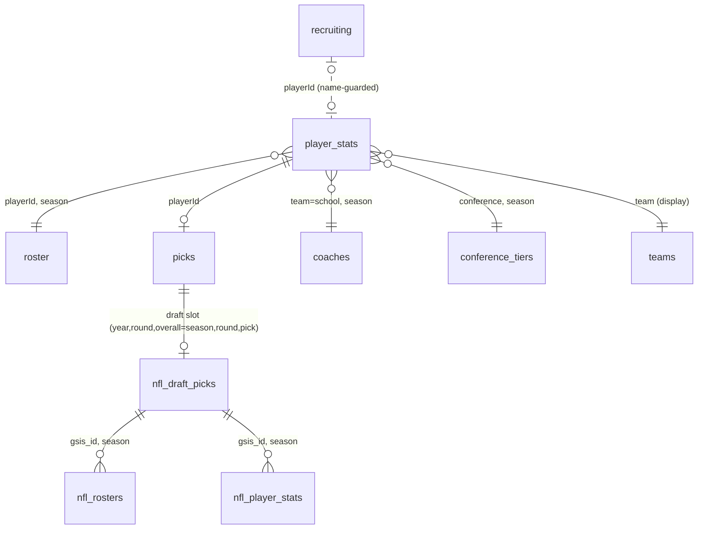

# cfbstats data model — ERD & query guide

This document describes how the cfbstats tables relate and how to reason over
them for the project's core question: **what shapes a college football player's
path to the NFL draft, and how well can it be forecast from information
available during their career?**

The authoritative, column-level schema for each table lives in the data
dictionaries next to this file, one YAML per table:

| Table | Grain | Dictionary |
|-------|-------|------------|
| `picks` | one drafted player | [`dict/picks.yml`](dict/picks.yml) |
| `player_stats` | **long**: player-season-category-statType-stat | [`dict/player_stats.yml`](dict/player_stats.yml) |
| `roster` | one player-season on a team roster | [`dict/roster.yml`](dict/roster.yml) |
| `coaches` | one head-coach-season | [`dict/coaches.yml`](dict/coaches.yml) |
| `teams` | one team (program) — DISPLAY only | [`dict/teams.yml`](dict/teams.yml) |
| `conference_tiers` | season × conference | [`dict/conference_tiers.yml`](dict/conference_tiers.yml) |
| `recruiting` | one HS recruit | [`dict/recruiting.yml`](dict/recruiting.yml) |
| `nfl_draft_picks` | one NFL draft pick | [`dict/nfl_draft_picks.yml`](dict/nfl_draft_picks.yml) |
| `nfl_rosters` | one player-season on an NFL roster | [`dict/nfl_rosters.yml`](dict/nfl_rosters.yml) |
| `nfl_player_stats` | one NFL player-season (regular season) | [`dict/nfl_player_stats.yml`](dict/nfl_player_stats.yml) |

The dictionaries document the **cleaned** schemas (e.g. `clean_picks` adds
`playerId`/`drafted`). The DuckDB asset described below carries exactly these
cleaned tables.

## The DuckDB asset

`data/cfbstats.duckdb` bundles every cleaned table into one SQL-queryable file.
It is built by the **`duckdb_file`** target in `_targets.R` (`build_duckdb()`,
decision 0016) from the cleaned, contract-checked tables — so its schema matches
the dictionaries above — and published alongside the parquet on the
`data-latest` GitHub release. Table names match the rows above
(`conference_tiers`, not `tiers`).

```r
library(DBI)
con <- dbConnect(duckdb::duckdb(), "data/cfbstats.duckdb", read_only = TRUE)
dbListTables(con)
dbGetQuery(con, "SELECT COUNT(*) FROM player_stats")
```

## Entity-relationship diagram



Solid lines are trustworthy joins; the dotted `recruiting` line is a
**name-guarded** link, not a plain key join (see below).

## Join keys & namespaces

There are five distinct join namespaces. Using the wrong one silently produces
wrong rows, so they are called out explicitly.

1. **College athlete id (`playerId`, string) — the canonical player key.**
   `player_stats.playerId`, `roster.playerId`, and `picks.playerId` (coerced from
   `collegeAthleteId`) are one namespace. Join players on this id, **never on
   name**. `roster` adds `season` for the player-season grain.

2. **Team / school name (string).** `player_stats.team` = `roster.team` =
   `coaches.school` = `teams.team`. `teams` is DISPLAY metadata only
   (logos/colors, decision 0008) — keep it off the model path.

3. **`(team, season)`** links a player-season to its head coach in `coaches`
   (a school can have >1 head coach in a season, so this is many-to-one and can
   inflate rows — intentional).

4. **`(conference, season)`** links to `conference_tiers`, which is
   **season-aware** (realignment over 2010–2026). Use the lookup; do not
   hard-code tiers.

5. **Draft slot then `gsis_id` (the NFL side).** CFBD `picks` bridges to
   `nfl_draft_picks` by draft slot — `(year, round, overall)` ==
   `(season, round, pick)` — **not** by `nflAthleteId` (a different namespace).
   From `nfl_draft_picks`, `gsis_id` is the key into `nfl_rosters` and
   `nfl_player_stats` (both keyed `(gsis_id, season)`).

### Two namespaces that look joinable but are not

- **`recruiting.playerId` is NOT the shared college-athlete namespace.** The
  CFBD `/recruiting/players` `athleteId` collides across different people. Never
  join `recruiting` on id alone — go through `link_recruiting()`, which
  name-guards the join. Genuinely unrated recruits are absent; model "unrated"
  as a real category rather than imputing (decision 0013).
- **`picks.nflAthleteId` is NOT the nflverse id.** It shares nothing with
  nflverse `gsis_id`/`espn_id`; use the draft-slot bridge above (decision 0014).

## Reasoning over the tables for the project's questions

**Population / outcome (v1).** The unit is a player-season with a qualifying
stat line in a draft-eligible season; the positive label is `drafted`. Build the
feature backbone from `player_stats` (which is **long** — pivot
`category`/`statType`/`stat` into position-relevant columns), attach roster
physicals, coaching and tier context, then join `picks` to label who was
drafted. This is what the `player_season -> ps_coach -> ps_tier -> ps_draft`
link targets do.

**Career inputs vs. outcomes — guard against leakage.** Everything on the NFL
side (`nfl_draft_picks`, `nfl_rosters`, `nfl_player_stats`) is an
**outcome/label**, never a model input. "How long they last" is defined
primarily as **distinct NFL roster seasons** (counts linemen/special-teamers who
accrue no box-score stats), complemented by career games and last active season.
These are **right-censored** for recent classes still active — treat them as "≥"
outcomes.

**Out-of-time evaluation.** A model must never see data from on/after the draft
class it predicts. When querying for a training frame, filter seasons strictly
before the target draft class.

**Watch for silent row loss.** Validate row counts before and after every join;
the `(team, season)` coach join can *inflate* rows, and id coercions or
name-guarded links can *drop* them.

### Example queries

Drafted rate by conference tier (label side):

```sql
SELECT t.tier_label,
       COUNT(*)                         AS player_seasons,
       SUM(CASE WHEN p.playerId IS NOT NULL THEN 1 ELSE 0 END) AS drafted
FROM player_stats s
JOIN conference_tiers t
  ON s.conference = t.conference AND s.season = t.season
LEFT JOIN picks p
  ON s.playerId = p.playerId
GROUP BY t.tier_label
ORDER BY t.tier_label;
```

NFL longevity (distinct roster seasons) for drafted players, via the slot bridge:

```sql
SELECT d.gsis_id,
       d.pfr_player_name,
       COUNT(DISTINCT r.season) AS nfl_seasons
FROM picks p
JOIN nfl_draft_picks d
  ON p.year = d.season AND p.round = d.round AND p.overall = d.pick
LEFT JOIN nfl_rosters r
  ON d.gsis_id = r.gsis_id
GROUP BY d.gsis_id, d.pfr_player_name
ORDER BY nfl_seasons DESC;
```

The slot bridge should be name-guarded in analysis (use `link_nfl_draft()` in R
rather than the raw SQL join) to drop the rare wrong-person slot match.
